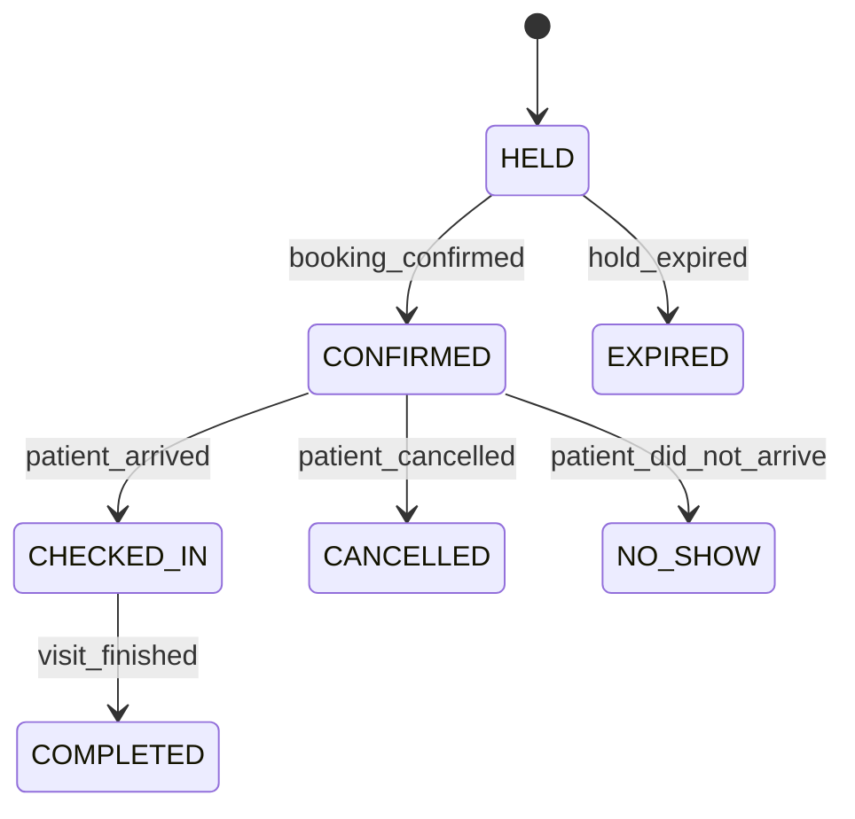

# Domain Model

This document describes the core entities of the Hospital Appointment & Scheduling System and their relationships. A well-defined domain model is crucial for building a maintainable and scalable system.

## 1. Entity-Relationship Diagram

The following diagram illustrates the relationships between the core entities in our system.

```mermaid
erDiagram
    Patient ||--o{ Appointment : "has"
    Provider ||--o{ Appointment : "has"
    Provider ||--o{ ProviderSchedule : "has"
    Location ||--o{ Provider : "is associated with"
    Appointment {
        string id
        datetime start_time
        datetime end_time
        string status
        string patient_id
        string provider_id
        string visit_type_id
    }
    Patient {
        string id
        string name
        string contact_info
    }
    Provider {
        string id
        string name
        string specialty
    }
    Location {
        string id
        string name
        string address
    }
    ProviderSchedule {
        string id
        string provider_id
        datetime start_time
        datetime end_time
        string type (e.g., "available", "break", "blocked")
    }
    VisitType {
        string id
        string name
        int duration_minutes
        int buffer_minutes
        json rules
    }
    WaitlistEntry {
        string id
        string patient_id
        string provider_id
        datetime requested_time
    }
    AuditEvent {
        string id
        string entity_id
        string entity_type
        string action
        datetime timestamp
        json details
    }
    Appointment ||--|{ VisitType : "is of"
    WaitlistEntry ||--o{ Provider : "for"
    WaitlistEntry ||--o{ Patient : "for"
```

## 2. Core Entities

### 2.1. Patient

-   **Description:** Represents an individual seeking medical care.
-   **Attributes:**
    -   `id`: Unique identifier for the patient.
    -   `name`: The patient's full name.
    -   `contact_info`: Contact details (e.g., phone number, email).
    -   Other PII as required (e.g., date of birth, insurance details), which should be stored securely.

### 2.2. Provider

-   **Description:** A healthcare provider (e.g., doctor, nurse practitioner) who can be scheduled for appointments.
-   **Attributes:**
    -   `id`: Unique identifier for the provider.
    -   `name`: The provider's full name.
    -   `specialty`: The provider's medical specialty (e.g., Cardiology, Pediatrics).
    -   `location_id`: The primary location where the provider works.

### 2.3. Location / Clinic

-   **Description:** A physical facility where appointments take place.
-   **Attributes:**
    -   `id`: Unique identifier for the location.
    -   `name`: The name of the clinic or hospital.
    -   `address`: The physical address of the location.

### 2.4. ProviderSchedule

-   **Description:** Defines the working hours, breaks, and other non-available times for a provider. This is the source of truth for a provider's availability.
-   **Attributes:**
    -   `id`: Unique identifier for the schedule entry.
    -   `provider_id`: Foreign key to the `Provider` entity.
    -   `start_time` & `end_time`: The start and end times of the schedule block.
    -   `type`: The type of block (e.g., `AVAILABLE`, `BREAK`, `LUNCH`, `UNAVAILABLE`).

### 2.5. Appointment

-   **Description:** Represents a scheduled appointment between a patient and a provider. This is the central entity in our system.
-   **Attributes:**
    -   `id`: Unique identifier for the appointment.
    -   `patient_id`: Foreign key to the `Patient` entity.
    -   `provider_id`: Foreign key to the `Provider` entity.
    -   `visit_type_id`: Foreign key to the `VisitType` entity.
    -   `start_time` & `end_time`: The scheduled start and end times of the appointment.
    -   `status`: The current status of the appointment (see state machine below).

### 2.6. VisitType

-   **Description:** A template for a specific type of appointment (e.g., "New Patient Visit," "Annual Check-up").
-   **Attributes:**
    -   `id`: Unique identifier for the visit type.
    -   `name`: The name of the visit type.
    -   `duration_minutes`: The standard duration of this type of visit.
    -   `buffer_minutes`: The required buffer time after this type of visit (for cleanup, etc.).
    -   `rules`: A JSON blob for any special rules associated with this visit type (e.g., requires a specific room or equipment).

## 3. Supporting Entities

### 3.1. WaitlistEntry

-   **Description:** An entry for a patient who wishes to be notified if an earlier appointment becomes available.
-   **Attributes:**
    -   `id`: Unique identifier for the waitlist entry.
    -   `patient_id`: Foreign key to the `Patient` entity.
    -   `provider_id`: Foreign key to the `Provider` entity.
    -   `requested_time`: The time frame the patient is interested in.

### 3.2. AuditEvent

-   **Description:** An immutable record of a significant event that occurred in the system, used for compliance and debugging.
-   **Attributes:**
    -   `id`: Unique identifier for the audit event.
    -   `entity_type` & `entity_id`: The type and ID of the entity that was acted upon (e.g., `APPOINTMENT`, `12345`).
    -   `action`: The action that was taken (e.g., `CREATE`, `UPDATE`, `CANCEL`).
    -   `timestamp`: When the action occurred.
    -   `details`: A JSON blob containing the details of the change.

## 4. Appointment Status State Machine

The `status` field of the `Appointment` entity follows a state machine:



-   **HELD:** A temporary status while a patient is in the process of booking a slot. The slot is held for a short period (e.g., 5 minutes).
-   **CONFIRMED:** The appointment has been successfully booked.
-   **EXPIRED:** The hold on the slot expired before the booking was confirmed.
-   **CHECKED_IN:** The patient has arrived for their appointment.
-   **COMPLETED:** The appointment has been completed.
-   **CANCELLED:** The appointment was cancelled by the patient or scheduler.
-   **NO_SHOW:** The patient did not show up for their appointment.

## Next Steps

- **[04-api-design.md](./04-api-design.md):** The design of the APIs for interacting with this domain model.