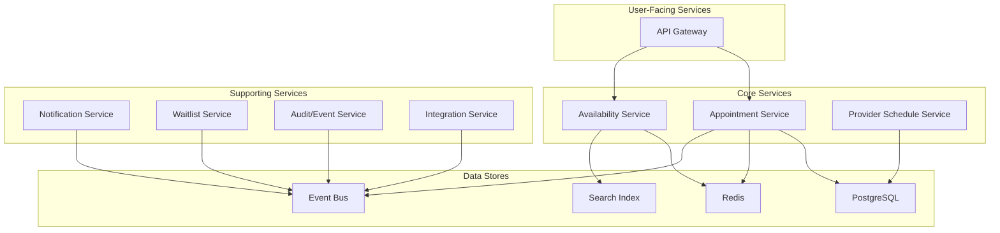

# Core Architecture

This document outlines the core technical architecture of the Hospital Appointment & Scheduling System. The architecture is designed to be scalable, reliable, and maintainable, following a microservices-based approach.

## 1. Architectural Goals

The architecture is designed with the following goals in mind:

- **Scalability:** The system must be able to handle a high volume of appointment requests and user traffic.
- **Reliability:** The system must be highly available and resilient to failures. Double-booking is not acceptable.
- **Maintainability:** The microservices architecture allows for independent development, deployment, and scaling of each component.
- **Flexibility:** The architecture should be flexible enough to accommodate new features and integrations in the future.

## 2. High-Level Diagram

The following diagram provides a high-level overview of the system architecture. For a more detailed version, please refer to the [high-level architecture diagram](</diagrams/01-high-level.mmd>).

## 3. Service Breakdown

### 3.1. User-Facing Services

-   **API Gateway:**
    -   **Purpose:** The single entry point for all client requests.
    -   **Responsibilities:** Handles cross-cutting concerns such as authentication, authorization, rate limiting, and request routing.
    -   **Technology:** A managed API gateway service (e.g., AWS API Gateway, Apigee) or a self-hosted solution like Kong or Traefik.

### 3.2. Core Services

-   **Appointment Service:**
    -   **Purpose:** Manages the lifecycle of appointments (booking, cancellation, rescheduling).
    -   **Responsibilities:** Enforces the core business logic and correctness rules to prevent double-booking. This is a critical, stateful service.
    -   **Interactions:** Communicates with the Availability Service to check for open slots, and with the data stores to persist appointment data.

-   **Availability Service:**
    -   **Purpose:** Provides fast, read-only access to available appointment slots.
    -   **Responsibilities:** This service is optimized for high-read throughput. It can either compute availability on-the-fly or serve pre-computed slots from a cache.
    -   **Interactions:** Reads from a Redis cache for speed, and may fall back to the Provider Schedule Service for more complex queries.

-   **Provider Schedule Service:**
    -   **Purpose:** Manages the schedules and availability of healthcare providers (doctors, rooms, equipment).
    -   **Responsibilities:** Provides an internal API for administrators to define and update schedules. This service is the source of truth for provider availability.
    -   **Interactions:** Persists schedule data in the PostgreSQL database.

### 3.3. Supporting Services

-   **Notification Service:**
    -   **Purpose:** Sends asynchronous notifications to users.
    -   **Responsibilities:** Consumes events from the event bus (e.g., appointment confirmations, reminders) and sends them via email, SMS, or push notifications.
    -   **Technology:** An asynchronous, event-driven service.

-   **Waitlist Service:**
    -   **Purpose:** Manages waitlists for fully booked providers or slots.
    -   **Responsibilities:** Allows patients to join a waitlist and automatically books an appointment if a slot becomes available.
    -   **Technology:** An asynchronous, event-driven service.

-   **Audit/Event Service:**
    -   **Purpose:** Provides an immutable log of all significant events in the system.
    -   **Responsibilities:** Subscribes to the event bus and stores all events for auditing, compliance, and analytics.
    -   **Technology:** An immutable log, potentially using a dedicated audit database or a specialized event store.

-   **Integration Service:**
    -   **Purpose:** Handles integrations with external systems.
    -   **Responsibilities:** Manages communication with external EHR/EMR systems, insurance providers, and other third-party services.
    -   **Technology:** This service acts as an anti-corruption layer, isolating the core system from the complexities of external integrations.

## 4. Data Store Breakdown

-   **PostgreSQL (OLTP):**
    -   **Purpose:** The primary transactional database for the system.
    -   **Data:** Stores core business data such as appointments, patient information, and provider schedules.
    -   **Reasoning:** A relational database is chosen for its strong consistency (ACID) guarantees, which are critical for preventing double-booking.

-   **Redis (Cache):**
    -   **Purpose:** A high-performance, in-memory cache.
    -   **Data:** Caches frequently accessed data, such as pre-computed availability slots. Also used for short-lived "holds" on appointment slots during the booking process.
    -   **Reasoning:** Redis provides low-latency reads, which is essential for the Availability Service to perform well under load.

-   **Event Bus (Kafka/SNS+SQS):**
    -   **Purpose:** A distributed event streaming platform for asynchronous communication between services.
    -   **Data:** Events such as `appointment_booked`, `appointment_cancelled`, `patient_registered`.
    -   **Reasoning:** An event bus decouples services from each other, improving resilience and scalability. It enables an event-driven architecture for services like Notifications and Auditing.

-   **Search Index (Elasticsearch/OpenSearch):**
    -   **Purpose:** A search engine for provider discovery.
    -   **Data:** Indexes provider information, specialties, and locations.
    -   **Reasoning:** A dedicated search index allows for fast and flexible full-text search, which is not a core competency of a relational database.

## Next Steps

- **[06-correctness-concurrency.md](./06-correctness-concurrency.md):** A deeper dive into the critical topic of ensuring correctness and handling concurrency.