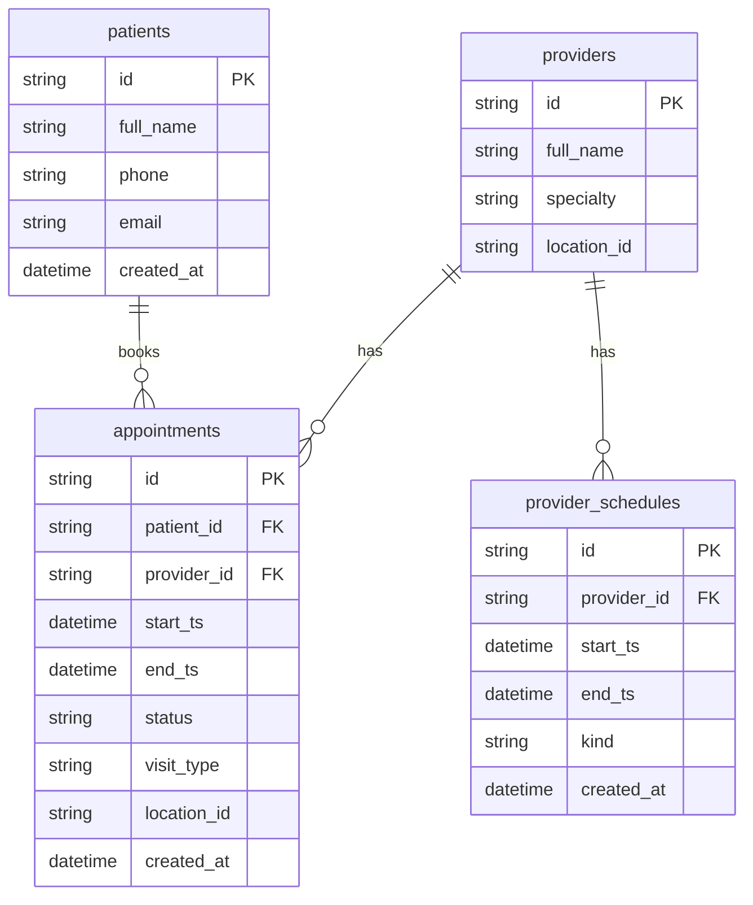

# Data Model (PostgreSQL)

This document provides a detailed overview of the PostgreSQL data model for the Hospital Appointment & Scheduling System. PostgreSQL is chosen as the primary database for its strong consistency (ACID) guarantees, which are essential for a system where correctness is paramount.

## 1. Schema Diagram



## 2. Table-by-Table Breakdown

### `patients`

-   **Purpose:** Stores information about the patients.
-   **Schema:**
    ```sql
    CREATE TABLE IF NOT EXISTS patients (
      id TEXT PRIMARY KEY,
      full_name TEXT NOT NULL,
      phone TEXT,
      email TEXT,
      created_at TIMESTAMPTZ NOT NULL DEFAULT now()
    );
    ```
-   **Design Notes:**
    -   `id` is a `TEXT` field to allow for the use of user-friendly, unique identifiers (e.g., UUIDs).
    -   Sensitive PII (Personally Identifiable Information) should be encrypted at the application layer or using database-level encryption.

### `providers`

-   **Purpose:** Stores information about the healthcare providers.
-   **Schema:**
    ```sql
    CREATE TABLE IF NOT EXISTS providers (
      id TEXT PRIMARY KEY,
      full_name TEXT NOT NULL,
      specialty TEXT NOT NULL,
      location_id TEXT NOT NULL
    );
    ```
-   **Design Notes:**
    -   `specialty` and `location_id` are key fields for searching and filtering.

### `provider_schedules`

-   **Purpose:** The source of truth for a provider's availability. This table defines the blocks of time a provider is working, on break, or otherwise unavailable.
-   **Schema:**
    ```sql
    CREATE TABLE IF NOT EXISTS provider_schedules (
      id TEXT PRIMARY KEY,
      provider_id TEXT NOT NULL REFERENCES providers(id),
      start_ts TIMESTAMPTZ NOT NULL,
      end_ts TIMESTAMPTZ NOT NULL,
      kind TEXT NOT NULL, -- SHIFT/BREAK/BLOCK
      created_at TIMESTAMPTZ NOT NULL DEFAULT now()
    );
    ```
-   **Design Notes:**
    -   `kind` is a simple but powerful way to represent different types of schedule blocks.
    -   This table is queried by the Availability Service to determine open slots.

### `appointments`

-   **Purpose:** The central table that stores all appointment information.
-   **Schema:**
    ```sql
    CREATE TABLE IF NOT EXISTS appointments (
      id TEXT PRIMARY KEY,
      patient_id TEXT NOT NULL REFERENCES patients(id),
      provider_id TEXT NOT NULL REFERENCES providers(id),
      start_ts TIMESTAMPTZ NOT NULL,
      end_ts TIMESTAMPTZ NOT NULL,
      status TEXT NOT NULL,
      visit_type TEXT NOT NULL,
      location_id TEXT NOT NULL,
      created_at TIMESTAMPTZ NOT NULL DEFAULT now()
    );

    CREATE INDEX IF NOT EXISTS idx_appointments_provider_start ON appointments(provider_id, start_ts);
    CREATE INDEX IF NOT EXISTS idx_appointments_patient_start ON appointments(patient_id, start_ts);
    ```
-   **Design Notes:**
    -   This table is the hot-spot for writes and must be protected by transactions to prevent double-booking.
    -   The indexes on `(provider_id, start_ts)` and `(patient_id, start_ts)` are critical for fast lookups of a provider's or patient's schedule.
    -   A `UNIQUE` constraint on `(provider_id, start_ts)` could be added as an extra layer of protection against double-booking, but this can be complex if appointments have variable end times. A more flexible approach is to use application-level logic within a transaction.

### `idempotency_keys`

-   **Purpose:** Supports idempotent `POST` requests to prevent duplicate resource creation on retries.
-   **Schema:**
    ```sql
    CREATE TABLE IF NOT EXISTS idempotency_keys (
      idempotency_key TEXT PRIMARY KEY,
      user_id TEXT NOT NULL,
      request_hash TEXT NOT NULL,
      response_ref TEXT NOT NULL,
      created_at TIMESTAMPTZ NOT NULL DEFAULT now()
    );
    ```
-   **Design Notes:**
    -   Before processing a request, the application checks if the `Idempotency-Key` exists in this table. If it does, it returns the stored response (`response_ref`) instead of re-processing the request.

### `appointment_audit`

-   **Purpose:** An immutable log of all changes to appointments, for compliance and auditing.
-   **Schema:**
    ```sql
    CREATE TABLE IF NOT EXISTS appointment_audit (
      id BIGSERIAL PRIMARY KEY,
      appointment_id TEXT NOT NULL,
      actor_id TEXT NOT NULL,
      action TEXT NOT NULL,
      ts TIMESTAMPTZ NOT NULL DEFAULT now(),
      payload JSONB NOT NULL
    );
    ```
-   **Design Notes:**
    -   This table should be append-only.
    -   `payload` is a `JSONB` field to store a snapshot of the appointment data at the time of the action. `JSONB` is used for its efficiency and queryability.

## Next Steps

- **[08-availability-computation.md](./08-availability-computation.md):** How the data in these tables is used to compute availability.