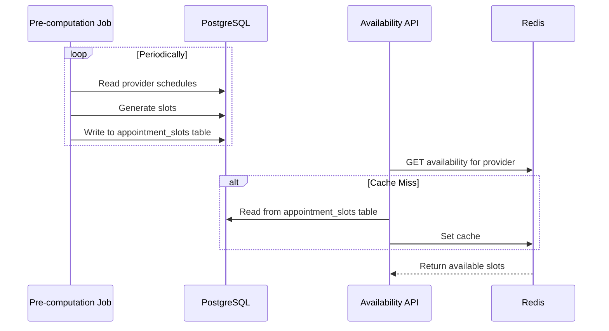

# Availability Computation

The Availability Service is one of the most critical components of the system from a performance perspective. It must handle a high volume of read requests while providing accurate, real-time information. This document explores the strategies for computing and serving availability.

## 1. The Challenge: A Computationally Intensive Problem

Calculating a provider's availability requires joining several sources of information:

1.  **Provider's base schedule:** When is the provider working? (from `provider_schedules`)
2.  **Existing appointments:** Which slots are already booked? (from `appointments`)
3.  **Visit type:** How long is the requested appointment? (from user input)

Performing this calculation on-the-fly for every request can be computationally expensive and may not scale to meet our peak QPS requirements.

## 2. Strategy A: On-the-Fly Computation with Caching

This is the simpler approach, suitable for smaller-scale systems.

### 2.1. The Process

1.  When a request comes in for a provider's availability on a given day, the service queries the database to get the provider's schedule and their existing appointments for that day.
2.  The service then computes the available slots in memory.
3.  The resulting list of slots is stored in a cache (e.g., Redis) with a key like `availability:provider_123:2024-10-28`.
4.  Subsequent requests for the same provider and day can be served directly from the cache.

### 2.2. Cache Invalidation

-   **TTL-based:** The cache entries have a short Time-To-Live (TTL), e.g., 1-5 minutes. This is simple but can lead to stale data.
-   **Event-driven:** When an appointment is booked or cancelled, the Appointment Service publishes an event (e.g., `appointment_changed`). The Availability Service subscribes to these events and invalidates the relevant cache entries. This is more complex but ensures better data freshness.

### 2.3. Tradeoffs

-   **Pros:** Simpler to implement. Data is always reasonably fresh.
-   **Cons:** Can be slow if there are many cache misses (the "thundering herd" problem). The database may still be hit frequently for cache misses.

## 3. Strategy B: Pre-computation and Slot Inventory

For larger-scale systems, a more robust approach is to treat availability as an **inventory of slots** that are pre-computed and managed explicitly.

### 3.1. The Process

1.  **Asynchronous Pre-computation:** A background job runs periodically (e.g., every few minutes or whenever a provider's schedule changes).
2.  **Generate Slots:** For each provider, the job looks ahead (e.g., for the next 6 months) and generates all possible appointment slots based on their schedule and the defined visit types.
3.  **Store as Inventory:** These potential slots are stored in a dedicated table, e.g., `appointment_slots`. Each slot has a status: `AVAILABLE`, `BOOKED`, etc.
    ```sql
    CREATE TABLE appointment_slots (
        id TEXT PRIMARY KEY,
        provider_id TEXT NOT NULL,
        start_ts TIMESTAMPTZ NOT NULL,
        end_ts TIMESTAMPTZ NOT NULL,
        status TEXT NOT NULL, -- AVAILABLE, BOOKED
        UNIQUE (provider_id, start_ts)
    );
    ```
4.  **Serve from Inventory:** The Availability Service becomes a simple read-through cache on top of this `appointment_slots` table. This is extremely fast.
5.  **Booking:** The booking process now becomes an atomic `UPDATE` on a row in the `appointment_slots` table, changing its status from `AVAILABLE` to `BOOKED`. This is a very fast and efficient transactional update.

### 3.2. Diagram



### 3.3. Tradeoffs

-   **Pros:** Extremely fast reads. The booking process is a simple, fast atomic update. The database is shielded from complex read queries.
-   **Cons:** More complex to implement due to the background pre-computation job. There is a potential for slightly stale data between job runs, but this can be mitigated by event-driven updates.

## 4. Recommended Approach

For a FAANG-scale system, **Strategy B (Pre-computation)** is generally preferred. The performance and scalability benefits of treating availability as a pre-computed inventory outweigh the added implementation complexity. The on-the-fly approach can be a good starting point for an MVP, but it is unlikely to scale to meet the demands of a large healthcare network.

## Next Steps

- **[09-notifications-waitlist.md](./09-notifications-waitlist.md):** The design of the asynchronous systems for notifications and waitlists.