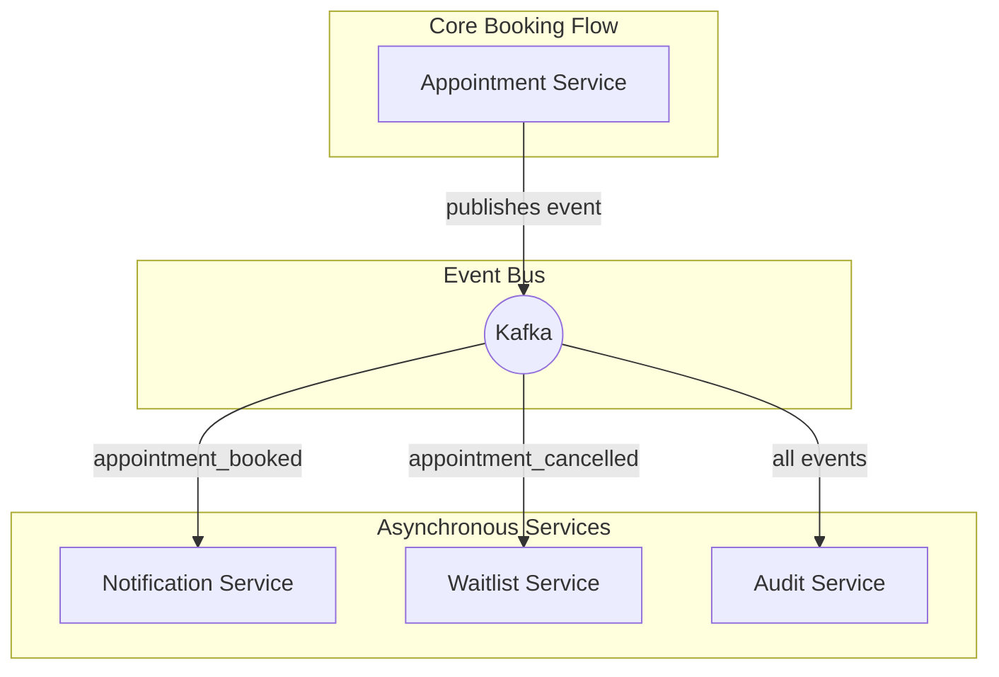
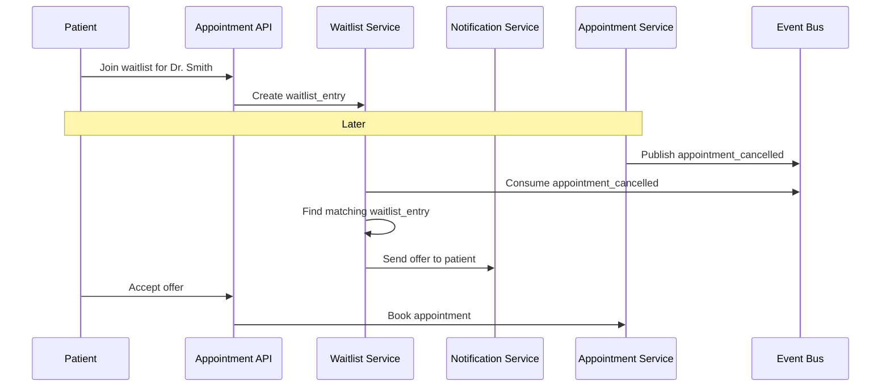

# Notifications & Waitlist Systems

The notification and waitlist systems are excellent examples of asynchronous, event-driven architecture. They are decoupled from the core booking flow, which improves the resilience and scalability of the overall system.

## 1. Event-Driven Architecture

The backbone of these systems is an event bus (e.g., Kafka, AWS SNS/SQS). The Appointment Service publishes events to the bus, and various downstream services consume these events to perform their tasks.

### Key Events

-   `appointment_booked`: Published when an appointment is successfully booked.
-   `appointment_cancelled`: Published when an appointment is cancelled.
-   `appointment_rescheduled`: Published when an appointment is rescheduled.

## 2. Notification System

The Notification Service is responsible for sending all user-facing communications.

### 2.1. Process Flow

1.  **Consume Event:** The Notification Service consumes an `appointment_booked` event from the event bus.
2.  **Generate Confirmation:** It formats a confirmation message (e.g., email, SMS).
3.  **Send Confirmation:** It sends the confirmation to the user via a third-party service (e.g., SendGrid for email, Twilio for SMS).
4.  **Schedule Reminder:** It schedules a job to send a reminder notification 24-48 hours before the appointment. This can be done using a scheduled job runner (e.g., Celery Beat, Quartz) or a service like AWS Step Functions.

### 2.2. Design Considerations

-   **Reliability:** The service must be reliable, with retries and dead-letter queues to handle failures in sending notifications.
-   **User Preferences:** The service should respect user preferences for notification channels (email, SMS, push).
-   **Templates:** Notification templates should be used to ensure consistent and high-quality messaging.

## 3. Waitlist System

The waitlist system provides a way for patients to get an earlier appointment if a slot becomes available due to a cancellation.

### 3.1. Process Flow

1.  **Join Waitlist:** A patient can request to join a waitlist for a specific provider and time range. This creates a `waitlist_entry` in the database.
2.  **Consume Cancellation Event:** The Waitlist Service consumes an `appointment_cancelled` event.
3.  **Find Match:** It checks if the newly available slot matches any `waitlist_entry`.
4.  **Offer Slot:** If a match is found, the service sends an "offer" to the first patient on the waitlist. This offer is time-sensitive (e.g., valid for 15 minutes).
5.  **Confirm or Expire:**
    -   If the patient accepts the offer, the Waitlist Service calls the Appointment Service to book the appointment.
    -   If the patient declines or the offer expires, the service offers the slot to the next patient on the waitlist.

### 3.2. Diagram

### 3.3. Design Considerations

-   **Fairness:** The waitlist must be fair (e.g., first-in, first-out).
-   **Concurrency:** The process of offering and accepting a slot must be handled carefully to avoid race conditions where multiple patients try to claim the same slot. Using short-lived holds (as discussed in the Correctness & Concurrency document) is a good pattern here.

## 4. Reducing No-Shows

These asynchronous systems can also be used to actively reduce no-shows:

-   **Confirmation Responses:** The confirmation email/SMS can include "Confirm" and "Cancel" links. If a user clicks "Cancel," the slot can be immediately offered to someone on the waitlist.
-   **Automated Re-offers:** If a patient cancels, the system can automatically trigger the waitlist process to fill the slot, maximizing provider utilization.

## Next Steps

- **[10-security-privacy-compliance.md](./10-security-privacy-compliance.md):** How to secure the system and ensure compliance with regulations like HIPAA.