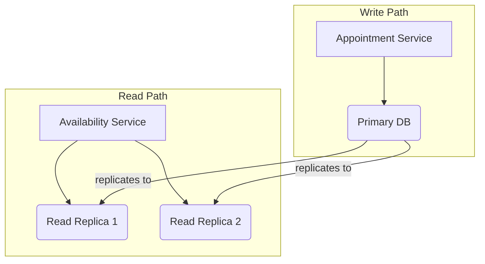
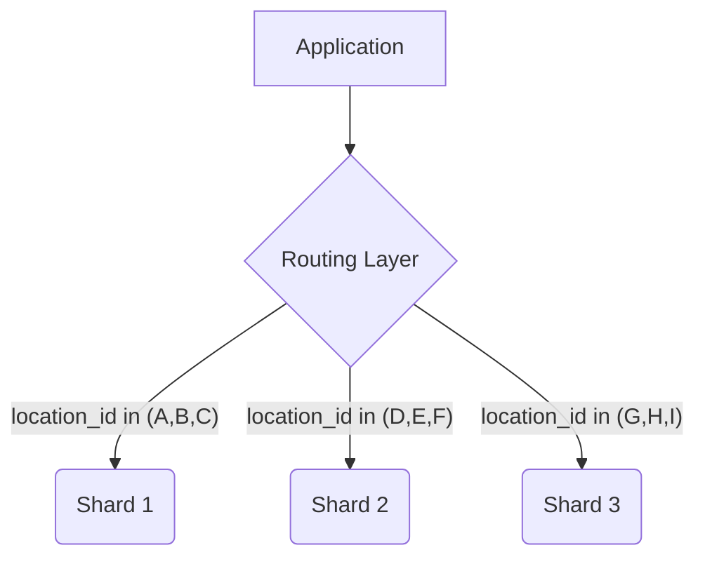

# Scalability & Partitioning

As the system grows to support more hospitals, providers, and patients, we need a clear strategy for scaling our infrastructure. This document outlines the key strategies for both scaling and partitioning the system.

## 1. Scaling Read-Heavy Workloads

As we identified in the Capacity Estimation, our system is read-heavy, especially the Availability Service.

### 1.1. Caching

-   **Strategy:** The first line of defense is aggressive caching. As discussed in the Availability Computation document, we can cache pre-computed availability slots in Redis.
-   **Benefits:** This dramatically reduces the load on our primary database.

### 1.2. Read Replicas

-   **Strategy:** We can configure our PostgreSQL database with one or more read replicas.
-   **Implementation:** The Availability Service and other read-heavy services can be configured to read from the replicas, while the Appointment Service (for writes) continues to use the primary database.
-   **Tradeoffs:** There is a small replication lag between the primary and the replicas, so this approach is suitable for data that can be slightly stale.

## 2. Partitioning (Sharding) the Database

As the dataset grows into the hundreds of gigabytes or terabytes, a single database can become a bottleneck. Partitioning, or "sharding," is the process of splitting the data across multiple database instances.

### 2.1. Partitioning Strategy

-   **Partition Key:** The key to a successful sharding strategy is choosing the right partition key. For our system, a good candidate is `location_id` or `clinic_id`. Most queries are scoped to a specific location (e.g., "find a doctor at the downtown clinic").
-   **Implementation:**
    1.  A routing layer is introduced between the application and the database shards.
    2.  When a query comes in, the routing layer inspects the `location_id` and directs the query to the correct shard.
    - **Initial State (Single DB):** All locations in one database.
    - **After Sharding:** 
        - **Shard 1:** Locations A, B, C
        - **Shard 2:** Locations D, E, F
        - **Shard 3:** Locations G, H, I

- **Cross-shard queries** are expensive, so the partition key must be chosen to minimize them.

### 2.2. Diagram

### 2.3. Archiving Old Data

-   **Strategy:** Another form of partitioning is to archive old data. For example, appointment records older than 2 years could be moved from the primary OLTP database to a cheaper, long-term storage solution (e.g., a data warehouse like Snowflake or Amazon S3).
-   **Benefits:** This keeps the primary database smaller and faster.

## 3. Handling "Hot Spots"

-   **Problem:** Some providers may be much more popular than others, creating "hot spots" in our data. For example, when a famous specialist's schedule opens up, their calendar will be hit with a massive amount of traffic.
-   **Strategies:**
    -   **Provider-Specific Queues:** For hot providers, we can introduce a request queue. Instead of hitting the database directly, booking requests are placed in a queue and processed sequentially. This provides backpressure and prevents the database from being overwhelmed.
    -   **More Granular Locking:** As discussed in the Correctness & Concurrency document, using a fine-grained lock (e.g., on a specific time slot) can reduce contention compared to locking the entire provider's schedule.

## 4. Multi-Region Deployment

-   **Problem:** If we have a global user base, users far from our primary data center will experience high latency.
-   **Strategy:** Deploy the application and databases to multiple regions.
-   **Implementation:**
    -   **Keep Writes Local:** A user's write requests (e.g., booking an appointment) should be routed to the region closest to them. The data for a specific location/clinic should "live" in one primary region.
    -   **Replicate Reads Globally:** Read-only data (like provider specialties, documentation, etc.) can be replicated across all regions for fast read access.

## Next Steps

- **[13-interview-playbook.md](./13-interview-playbook.md):** A playbook for structuring your answer in a system design interview.